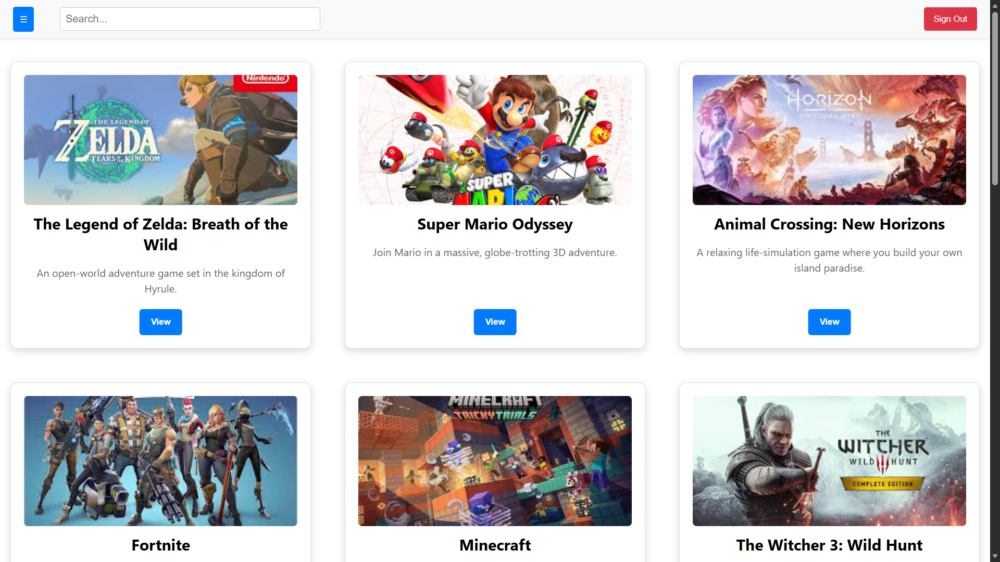
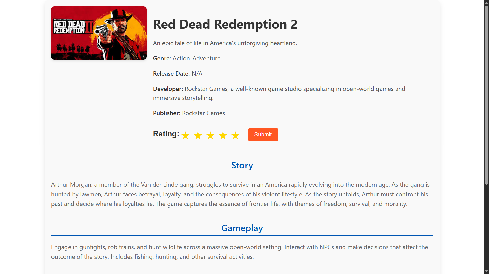
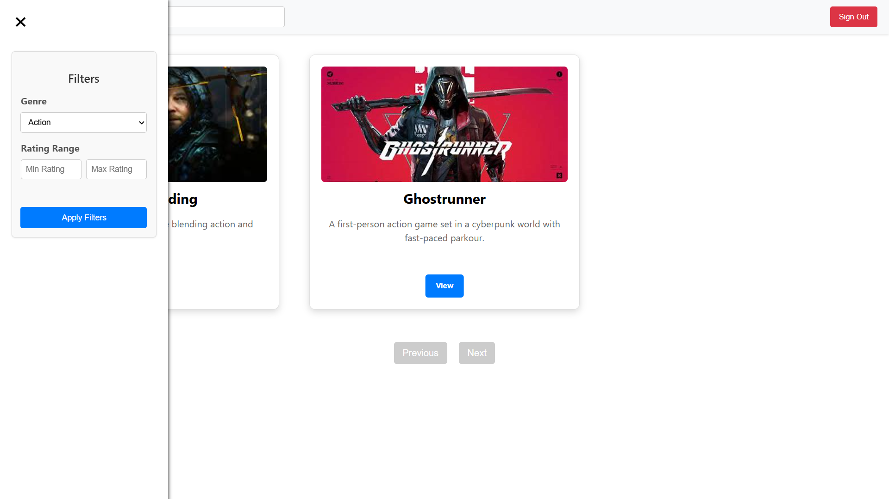
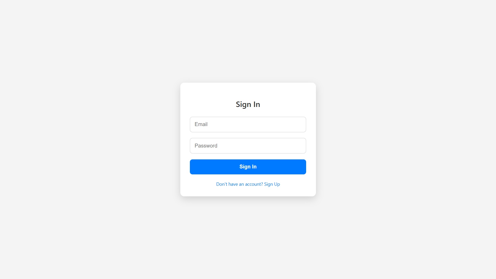
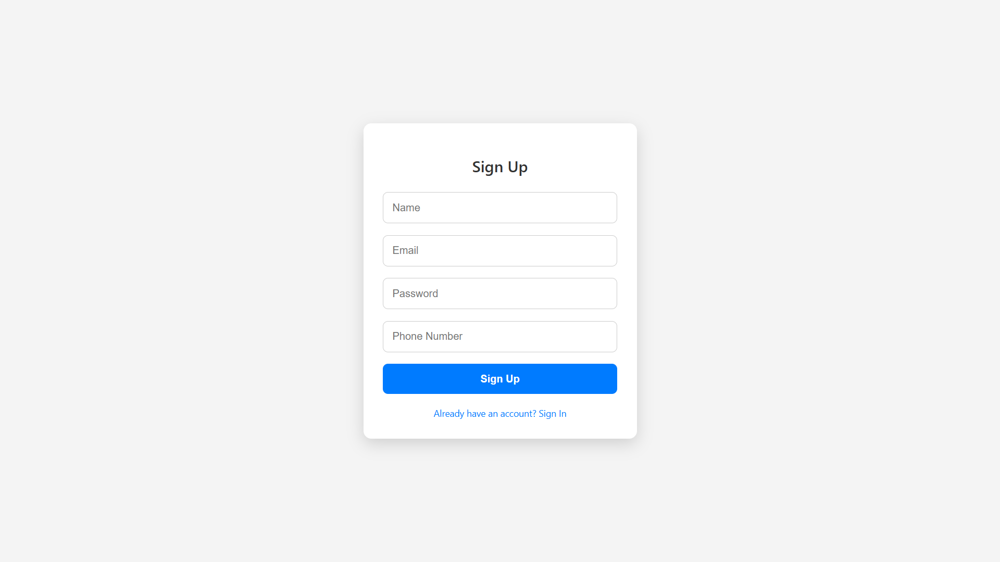

# 🎮 GameInfo

A modern, full-stack web application for discovering and exploring video games. Built with React and Express.js, featuring a beautiful UI with animations, responsive design, and user authentication.


---

## ✨ Features

- 🎯 **Browse Games** - Explore a collection of video games with detailed information
- 🔍 **Search & Filter** - Find games by name or filter by genre
- 📱 **Responsive Design** - Optimized for all devices (desktop, tablet, mobile)
- 🎨 **Modern UI** - Beautiful animations, badges, overlays, and hover effects
- 🔐 **User Authentication** - Secure sign-up and sign-in functionality with JWT
- ⭐ **Game Details** - View comprehensive information including ratings, descriptions, and images

---

## 📸 Screenshots

### 🏠 Home Page


### 🎮 Game Details


### 🔍 Filter by Genre


### 🔐 Authentication

| Login | Sign Up |
|:-----:|:-------:|
|  |  |

---

## 🛠️ Tech Stack

### Frontend
- **React 18** - Modern React with hooks
- **React Router v6** - Client-side routing
- **CSS3** - Custom animations and responsive grid layouts

### Backend
- **Express.js** - Fast, minimalist web framework
- **MongoDB** - NoSQL database with Mongoose ODM
- **JWT** - JSON Web Tokens for authentication
- **bcryptjs** - Password hashing

---

## 📁 Project Structure

```
Game-Info/
├── backend/                 # Express.js backend
│   ├── data/               # Database seed data
│   ├── images/             # Game images
│   ├── models/             # Mongoose models
│   ├── routes/             # API routes
│   └── server.js           # Server entry point
├── src/                    # React frontend source
│   ├── components/         # React components
│   │   ├── Filter.js       # Genre filter component
│   │   ├── GameCard.js     # Individual game card
│   │   ├── GameContainer.js# Games grid container
│   │   ├── GameDetail.js   # Game details page
│   │   ├── GameList.js     # Games listing
│   │   ├── Header.js       # Navigation header
│   │   ├── Layout.js       # Page layout wrapper
│   │   ├── SignIn.js       # Login component
│   │   └── SignUp.js       # Registration component
│   ├── style/              # Component styles
│   ├── App.js              # Main App component
│   └── index.js            # React entry point
├── public/                 # Static assets
└── package.json            # Frontend dependencies
```

---

## 🚀 Getting Started

### Prerequisites

- **Node.js** (v14 or higher)
- **MongoDB** (local installation or MongoDB Atlas)
- **npm** or **yarn**

### Installation

1. **Clone the repository**
   ```bash
   git clone https://github.com/0SAKESH0/Game-Info.git
   cd Game-Info
   ```

2. **Install frontend dependencies**
   ```bash
   npm install
   ```

3. **Install backend dependencies**
   ```bash
   cd backend
   npm install
   cd ..
   ```

4. **Set up MongoDB**
   - Make sure MongoDB is running on `localhost:27017`
   - The database `GameInfo` will be created automatically

5. **Seed the database** (optional)
   ```bash
   cd backend
   node insert.js
   cd ..
   ```

### Running the Application

1. **Start the backend server**
   ```bash
   cd backend
   node server.js
   ```
   The API will be available at `http://localhost:5000`

2. **Start the frontend** (in a new terminal)
   ```bash
   npm start
   ```
   The app will open at `http://localhost:3000`

---

## 🔌 API Endpoints

### Games
| Method | Endpoint | Description |
|--------|----------|-------------|
| GET | `/api/games` | Get all games (supports `?search=` and `?genre=` query params) |
| GET | `/api/games/:id` | Get a specific game by ID |

### Authentication
| Method | Endpoint | Description |
|--------|----------|-------------|
| POST | `/api/auth/signup` | Register a new user |
| POST | `/api/auth/signin` | Login user |

---

## 🎨 UI Features

- **Game Cards** - Animated cards with badges, overlays, and hover effects
- **Responsive Grid** - Adaptive layout for different screen sizes
- **Loading States** - Smooth loading animations
- **Filter Accordion** - Collapsible genre filters with sliders
- **Form Validation** - Real-time validation feedback on auth forms

---

## 📝 Environment Variables

Create a `.env` file in the `backend` folder for sensitive configuration:

```env
JWT_SECRET=your_jwt_secret_key
MONGODB_URI=mongodb://localhost:27017/GameInfo
```

---

## 🤝 Contributing

Contributions are welcome! Please feel free to submit a Pull Request.

1. Fork the repository
2. Create your feature branch (`git checkout -b feature/AmazingFeature`)
3. Commit your changes (`git commit -m 'Add some AmazingFeature'`)
4. Push to the branch (`git push origin feature/AmazingFeature`)
5. Open a Pull Request

---

## 📄 License

This project is open source and available under the [MIT License](LICENSE).

---

## 👨‍💻 Author

Made with ❤️ by [selvacoder](https://github.com/selvacoder) [0SAKESH0](https://github.com/0SAKESH0)

---

<p align="center">
  <i>⭐ Star this repo if you find it helpful!</i>
</p>
